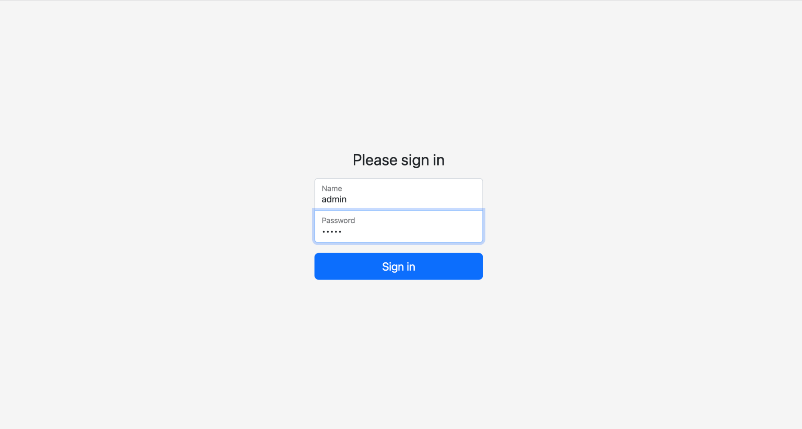
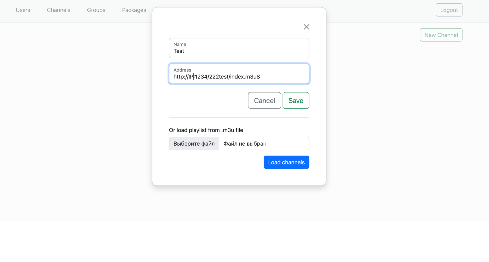
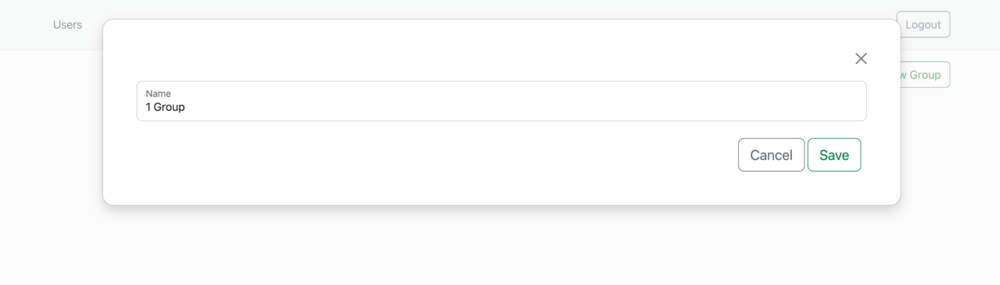
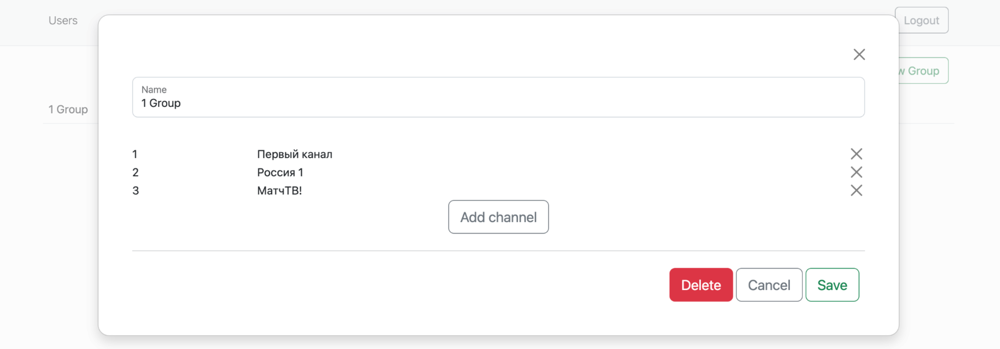
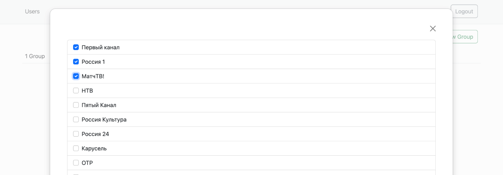
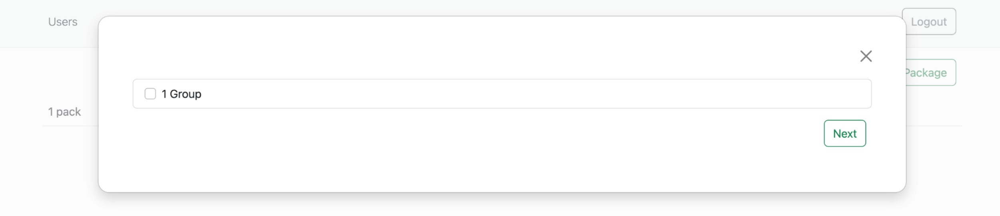
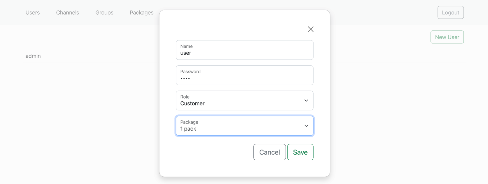

+++
author = "Cesbo"
title = "Senta"
date = "2023-02-26"
tags = [
    "video",
    "playlist",
]
categories = [
    "streaming",
    "software",
]
+++
# Quick start

The Senta interface allows you to provide access to the channel playlist for users connected to the server.

In order to start using the Senta interface, you need the following set of actions.

<!--more-->

## Start up

Open the terminal of the server on which you want to deploy Senta. In this terminal window, enter the following commands:

```
 ./senta init
Service name [senta]: senta
Database path [/var/lib/senta.db]: test3.db
Admin login [admin]: admin
Admin password [728539]:
Confirm password:
HTTP Server Port [8500]: 8500
Add service to systemd? [Y/n/?]: n
Start service [Y/n/?]: n
```

- `./senta init` - Senta initialization
- `Service name [senta]:` - arbitrary server name
- `Database path [/var/lib/senta.db]:` - path to the database being used

>In "Database path" a folder in which the used file must be located is already exists. In the input line, only its name is indicated

- `Admin login [admin]:` - login access to Senta
- `Admin password [728539]:` - password access to Senta
- `Confirm password:` - repeat your password

>while entering and repeating the password, the entered characters are not displayed

- `HTTP Server Port [8500]:` - port of the server to which Senta will connect
- `Add service to systemd? [Y/n/?]:` - standard Linux prompt to create Systemd service
- `Start service [Y/n/?]:` - Senta launch

After installing Senta on the server, it is launched by executing the following command:

`./senta test4.db`

## Web interface

Open a web browser and navigate to the address in order to access Senta's web interface.
Senta access address is **http://[IP]:8500/login**



- **login** - login access to Senta that you set during the installation of Senta interface
- **password** - password access to Senta that you set during the installation of Senta interface

## Work prepearing

To add channels, you need to load a playlist using the **Channels** panel



- **name** - input field to arbitrary playlist name
- **address** - input field that contains playlist link
- **or load from .m3u file** - if you have a prepared playlist in the appropriate resolution, you can simply upload it in this panel

To create groups of TV channels selected from the downloaded playlist, you need to use the **Groups** tab



- **name** - input field to arbitrary group name

After adding a group, you can add the channels included in it



- **add channel** - button that allows you to open a panel to add new channels to the group



- a **checkbox** next to a channel from the list, adds it to the group

To create channel packages that are combined groups, you must use the **Packages** panel



- When adding a new **package**, you specify an arbitrary name for it and add channel groups to it. These actions are completely similar to the process of adding Channels to groups

To add a new user and give him his set of channels, you must use the **Users** tab



- **name** - input field to arbitrary user name
- **password** - input field for entering a password by which the user will gain access to his channels
- **role** - drop-down list to select the user's role
- **package** - drop-down list to select the channel package available to the user

## Complete

Senta is now set up and ready to go. To access the user's playlist, you need to go to the appropriate address in a web browser and enter login and password data

User playlist link **http://[IP]:8500/playlist**
